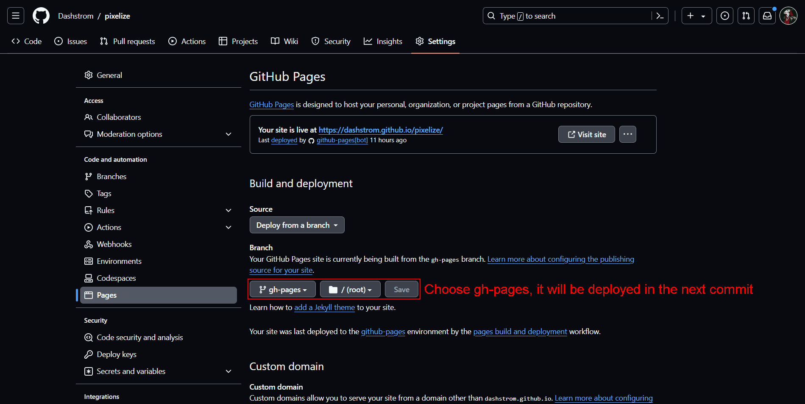
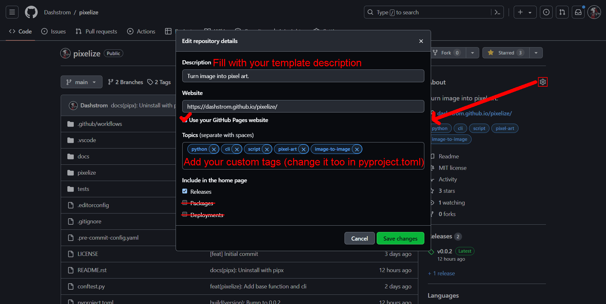
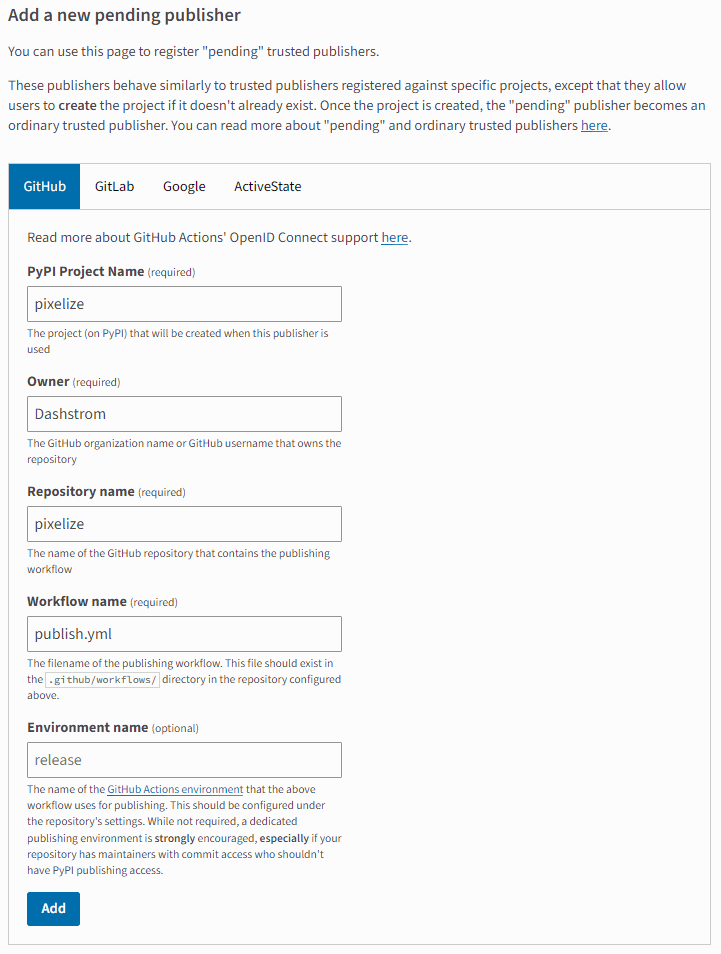

# Python template

[](https://mypy-lang.org/)
[](https://github.com/astral-sh/ruff)
[](https://devguide.python.org/versions)
[](https://gitlab.utc.fr/utcode/utcode-autofill/blob/main/LICENSE)
[](https://github.com/Dashstrom/python-template/actions/workflows/tests.yml)

## Description

A medium complexity template for create CLI or python package.

## Your gratitude warms my heart 💖

If you like this project or use it in your own project.
Please, share it and add a little star for me ⭐

## Tools used

- [Commitizen](https://github.com/commitizen-tools/commitizen) A tool to create committing rules for projects.
- [Cookiecutter](https://www.cookiecutter.io) A cross-platform command-line utility that creates projects.
- [Doctest](https://docs.pytest.org/en/7.4.x/how-to/doctest.html) Executes tests in docstrings
- [Editorconfig](https://editorconfig.org/) Configuration file format for defining coding styles in shared projects.
- [Git](https://git-scm.com/) Git is the most widely used version control system.
- [Github Actions](https://docs.github.com/en/actions) Automate and execute your software development workflows right in your repository.
- [Mypy](https://mypy.readthedocs.io/en/stable) Optional static typing for Python.
- [Poe the Poet](https://poethepoet.natn.io/index.html) A task runner that works well with poetry.
- [Pre-commit](https://pre-commit.com) A framework for managing and maintaining multi-language pre-commit hooks.
- [Pytest](https://docs.pytest.org/en/7.4.x) Framework making it easy to write small tests, yet scales to support complex functional testing.
- [Ruff](https://beta.ruff.rs/docs/rules) An extremely fast Python linter, written in Rust.
- [Sphinx with read the docs theme](https://sphinx-rtd-theme.readthedocs.io/en/stable) Sphinx makes it easy to create intelligent and beautiful documentation.
- [UV](https://docs.astral.sh/uv) An extremely fast Python package and project manager, written in Rust.

## Prerequisite

First, you will need to install a version of [python](https://www.python.org) higher or equal to 3.9. Then, you must install [Visual Studio Code](https://code.visualstudio.com), [uv](https://docs.astral.sh/uv/getting-started/installation/) and [git](https://git-scm.com/book/en/v2/Getting-Started-Installing-Git).

## Generate template

First you need to create your repository as follows:

```bash
uvx cookiecutter --accept-hooks yes gh:Dashstrom/python-template
```

## Configuration

### Enable GitHub pages

Go to `https://github.com/GITHUB_USERNAME/PROJECT_NAME/settings/pages` and change branch for GitHub Pages:

[](docs/resources/pages.png)

## Add description, website and tag

Go to `https://github.com/GITHUB_USERNAME/PROJECT_NAME` and follow instructions:

[](docs/resources/config.png)

## Enable publish on PyPI

Create a PyPI account and go to bottom of [this page](https://pypi.org/manage/account/publishing)

[](docs/resources/pypi.png)

## Testing

```bash
python tests/test_template.py
```

## Green IT

For going further, you can use [shrinkix](https://github.com/Dashstrom/shrinkix) for compress your images.
