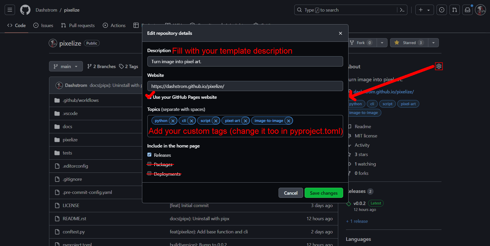

.. role:: bash(code)
  :language: bash

***************
Python template
***************

|mypy| |ruff| |python| |license| |ci-tests|

.. |mypy| image:: https://www.mypy-lang.org/static/mypy_badge.svg
  :target: https://mypy-lang.org/
  :alt: Mypy

.. |ruff| image:: https://img.shields.io/endpoint?url=https://raw.githubusercontent.com/astral-sh/ruff/main/assets/badge/v2.json
  :target: https://github.com/astral-sh/ruff
  :alt: Ruff

.. |python| image:: https://img.shields.io/badge/python-3.8%20|%203.9%20|%203.10%20|%203.11%20|%203.12-%23007EC6.svg
  :target: https://devguide.python.org/versions
  :alt: Python : 3.8 3.9 3.10 3.11 3.12

.. |license| image:: https://img.shields.io/badge/license-MIT-green.svg
  :target: https://gitlab.utc.fr/utcode/utcode-autofill/blob/main/LICENSE
  :alt: License : MIT

.. |ci-tests| image:: https://github.com/Dashstrom/python-template/actions/workflows/tests.yml/badge.svg
  :target: https://github.com/Dashstrom/python-template/actions/workflows/tests.yml
  :alt: CI : Tests

Description
###########

A medium complexity template for create CLI or python package.

Tools used
##########

- `Commitizen <https://github.com/commitizen-tools/commitizen>`_ A tool to create committing rules for projects.
- `Cookiecutter <https://www.cookiecutter.io>`_ A cross-platform command-line utility that creates projects.
- `Doctest <https://docs.pytest.org/en/7.4.x/how-to/doctest.html>`_ Executes tests in docstrings
- `Editorconfig <https://editorconfig.org/>`_ Configuration file format for defining coding styles in shared projects.
- `Git <https://git-scm.com/>`_ Git is the most widely used version control system.
- `Github Actions <https://docs.github.com/en/actions>`_ Automate and execute your software development workflows right in your repository.
- `Mypy <https://mypy.readthedocs.io/en/stable/>`_ Optional static typing for Python.
- `Poetry <https://python-poetry.org/>`_ Python packaging and dependency management made easy.
- `Poe the Poet <https://poethepoet.natn.io/index.html>`_ A task runner that works well with poetry.
- `Pre-commit <https://pre-commit.com/>`_ A framework for managing and maintaining multi-language pre-commit hooks.
- `Pytest <https://docs.pytest.org/en/7.4.x/>`_ Framework making it easy to write small tests, yet scales to support complex functional testing.
- `Ruff <https://beta.ruff.rs/docs/rules/>`_ An extremely fast Python linter, written in Rust.
- `Sphinx with read the docs theme <https://sphinx-rtd-theme.readthedocs.io/en/stable/>`_ Sphinx makes it easy to create intelligent and beautiful documentation.

Prerequisite
############

First, you will need to install a version of `python <https://www.python.org/>`_ higher or equal to 3.8 and `Visual Studio Code <https://code.visualstudio.com/>`_. 

You need to install `pipx <https://pypa.github.io/pipx/installation/>`_, `cookiecutter <https://cookiecutter.readthedocs.io/en/1.7.3/installation.html>`_ and `poetry <https://python-poetry.org/docs/#installation>`_ with the following commands:

..  code-block:: bash

  pip install --user pipx
  pipx ensurepath
  pipx install cookiecutter poetry

You will also need to install `git <https://git-scm.com/>`_ following `the official guide <https://git-scm.com/book/en/v2/Getting-Started-Installing-Git>`_.

Installation
############

First you need to create your repository then process as follows:

..  code-block:: bash

  cookiecutter --accept-hooks yes gh:Dashstrom/python-template

Configuration
#############

Enable GitHub pages
*******************

Go to https://github.com/GITHUB_USERNAME/PROJECT_NAME/settings/pages and change branch for GitHub Pages:

.. image:: docs/resources/pages.png
  :target: docs/resources/pages.png
  :alt: Configure GitHub Pages

Add description, website and tag
********************************

Go to https://github.com/GITHUB_USERNAME/PROJECT_NAME and follow instructions:

Enable publish on PyPI
**********************

Create a PyPI account and go to bottom of page https://pypi.org/manage/account/publishing

.. image:: docs/resources/pypi.png
  :target: docs/resources/pypi.png
  :alt: Configure PyPI

Testing
#######

..  code-block:: bash

  python tests/test_template.py
